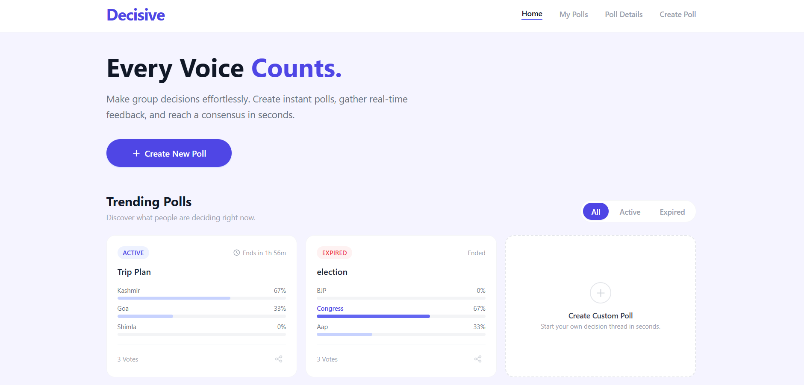
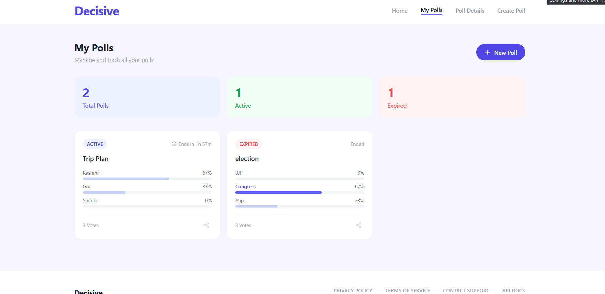
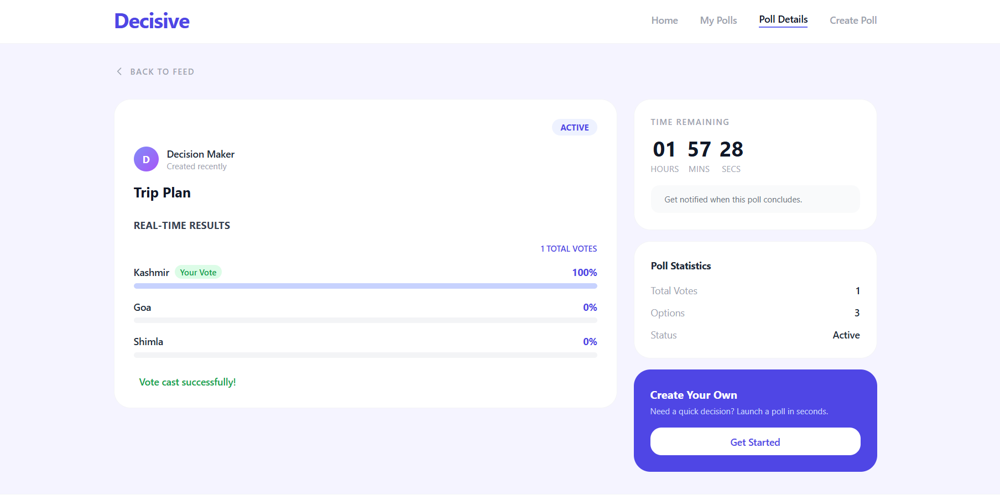
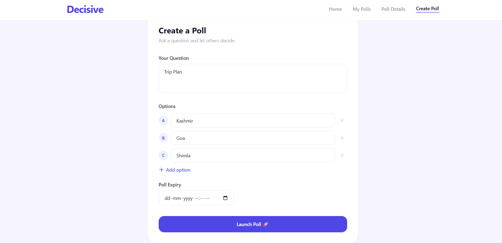

# Polling-System
# Quick Decision Maker

A full-stack web app where users can create polls and others can vote to help make decisions.

## Tech Stack

- **Frontend:** React, Tailwind CSS, Axios
- **Backend:** Node.js, Express.js
- **Database:** MongoDB Atlas

## Features

- Create a poll with a question and 2-4 options
- Set an expiry time for each poll
- Vote on active polls (one vote per browser)
- See real-time vote counts and percentages
- Polls automatically become inactive after expiry
- View the winning option after a poll expires
- Filter polls by Active or Expired
- Delete polls from My Polls page

 

## Setup Instructions

### 1. Clone the repository

bash:
git clone https://github.com/your-username/decision-maker.git
cd decision-maker

### 2. Backend Setup

bash:
cd backend
npm install

Create a .env file inside the backend folder:

MONGO_URI=your_mongodb_atlas_connection_string

To get your MongoDB connection string:
1. Go to [MongoDB Atlas](https://cloud.mongodb.com)
2. Open your cluster
3. Click **Connect** → **Drivers**
4. Copy the connection string and replace <password> with your actual password

Start the backend server:

bash:
node server.js

You should see:

MongoDB Atlas Connected!
Server running on http://localhost:5000

### 3. Frontend Setup

bash:
cd frontend
npm install
npm run dev

Open your browser and go to: `http://localhost:5173`

## API Endpoints

| Method | Endpoint | Description |
|--------|----------|-------------|
| GET | /api/polls | Get all polls |
| GET | /api/polls?filter=active | Get active polls only |
| GET | /api/polls?filter=expired | Get expired polls only |
| POST | /api/polls | Create a new poll |
| POST | /api/polls/:id/vote | Vote on a poll |
| DELETE | /api/polls/:id | Delete a poll |

## Screenshots
Home page-

My polls-

Poll-detail-

Create-poll-
 
>  

## Notes

- Voting is tracked per browser using localStorage
- Each browser can only vote once per poll
- Polls cannot be voted on after they expire
